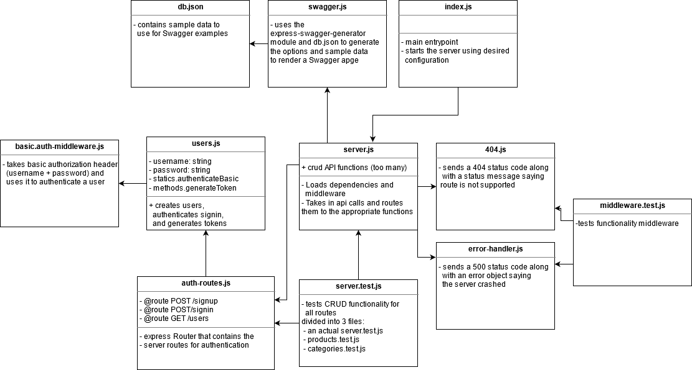

# Lab 10 — Authentication

## An Express server with basic authentication

Lab 10 and then some for CF JS 401 Nights (n16)

### Author: Earl Jay Caoile

### Links and Resources

#### Submission Reqs

- [submission PR](https://github.com/earljay-caoile-401-advanced-javascript/auth-server/pull/1)
- [GitHub Actions](https://github.com/earljay-caoile-401-advanced-javascript/auth-server/actions)
- [Swagger API Documentation (Heroku Deployment)](https://cf-js-401-auth-server.herokuapp.com/api-docs)

#### Resources

- [Swagger Editor (good for validation)](https://editor.swagger.io/)
- [Code Fellows Supergoose](https://www.npmjs.com/package/@code-fellows/supergoose)

### Documentation

- [SuperAgent](https://visionmedia.github.io/superagent/)
- [using express middleware](https://expressjs.com/en/guide/using-middleware.html)
- [express routing](https://expressjs.com/en/guide/routing.html)
- [HTTP Status Codes](https://www.restapitutorial.com/httpstatuscodes.html)
- [Authentication with Insomnia](https://support.insomnia.rest/article/38-authentication)

### Setup

#### Configuring MongoDB

- create an .env file on the top level of this repo with the following information:
  ``` 
  PORT=3000
  HOST=localhost:3000
  MONGODB_URI=mongodb://localhost:27017/auth-server
  ```
- start your database with the path of the DB along with the folder location for your DB files (`mongod --dbpath=/Users/path/to/data/db`: i.e. `"C:\Program Files\MongoDB\Server\4.2\bin\mongod.exe" --dbpath="D:\db"`)
- install node packages locally with `npm i` from the root directory in Terminal
- start the server with `nodemon index.js`

**Note:** for Heroku deployment, `MONGODB_URI` needs to have a value filled out in settings. The mLab add-on handles this automatically by filling out the variable and giving you a MongoDB to use.
As of this revision, you need to put in the HOST variable as well. 

#### Tests

- Testing command: `npm test` from root directory

### UML


